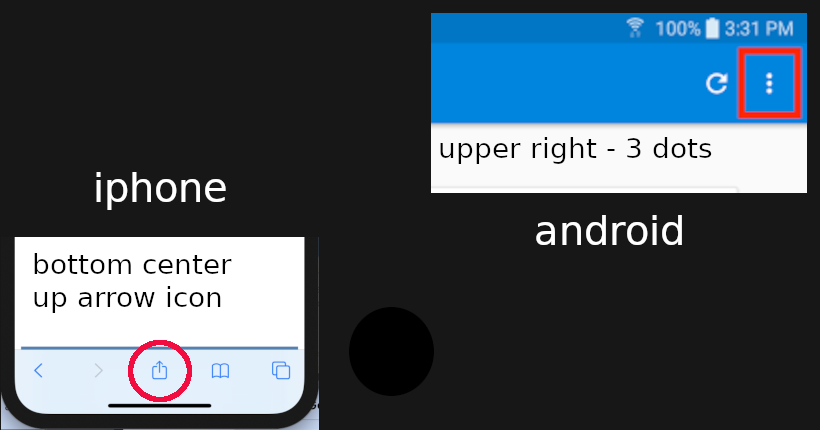

# lyarncheef.github.io
Ayuda folder contains a single html file displaying in spanish, emergency instructions for handling visits or raids by ICE and can be installed to a phone's home page ( iphone/ android ) by going to a mobile browser, bringing up [this page](https://lyarncheef.github.io/ayuda) and then following the respective platforms instructions for
   **add to homescreen**
### Add to homescreen instructions varies slightly ( iphone vs android ) 
- bring up a browser ( iphone & android )
- go the URL in the link above **this page**
- you will see red page of legal advice thats in Spanish
- use the proper icon for a menu:
- see bottom of page **up arrow** icon ( iphone only ) 
- see upper right-hand **3 dots** icon ( android only )
- tap the icon for your particular phone 
- selection list of actions will appear
- locate in the list **add to homescreen** and tap on it 

  
